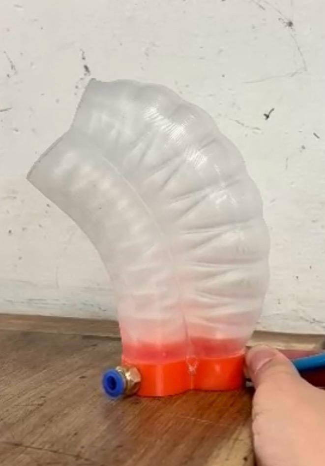
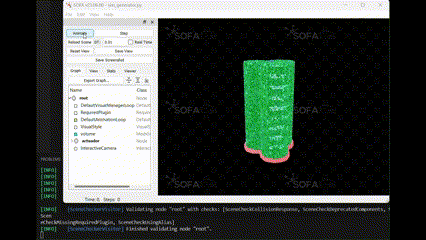

# SoftRobotics

## Introducción
Este es el repositorio de un grupo de trabajo para el curso de Soft Robotics (IMEC-4550) de la Universidad de Los Andes.

<p align="center">
  
</p>
<p align="center">
  
</p>


### Demo de los resultados obtenidos
<p align="center"></p>
<p align="center"></p>

## Programas usados en el desarrollo
- Blender (para diseño 3D)
- Fusion 360 (opcional, para diseño CAD avanzado)
- Arduino IDE (para programación de microcontroladores)

## Prerequsitos
- SOFA Framework
- Python 3.8
- pip
- virtualenv

## Configuración del Entorno de Desarrollo

### Instalación de SOFA y Herramientas CAD
1. **SOFA Framework**: Sigue las instrucciones de instalación en la [página oficial de SOFA](https://www.sofa-framework.org/download/).
2. **Blender**: Descarga e instala Blender desde [su sitio web oficial](https://www.blender.org/download/).
3. **Fusion 360**: Regístrate y descarga Fusion 360 desde [su sitio web oficial](https://www.autodesk.com/products/fusion-360/overview).
4. **Arduino IDE**: Descarga e instala el Arduino IDE desde [su sitio web oficial](https://www.arduino.cc/en/software).

### Configuración del Entorno Python

1. **Clona el Repositorio**

    Clona este repositorio a tu máquina local usando el siguiente comando Git:

    ```bash
    git clone https://github.com/wampah/SoftRobotics.git
    cd SoftRobotics
    ```

2. **Crea y Activa un Entorno Virtual**

    Crea un entorno virtual para manejar las dependencias del proyecto de manera aislada:

    ```bash
    virtualenv soro_venv --python=python3.8
    ```

    Activa el entorno virtual:

    - En Windows:
        ```bash
        .\soro_venv\Scripts\activate
        ```

    - En macOS y Linux:
        ```bash
        source soro_venv/bin/activate
        ```

3. **Instala las Dependencias**

    Con el entorno virtual activo, instala las dependencias necesarias ejecutando:

    ```bash
    pip install -r requirements.txt
    ```

## Licencia
Este proyecto está bajo la Licencia MIT - consulta el archivo `LICENSE` para más detalles.